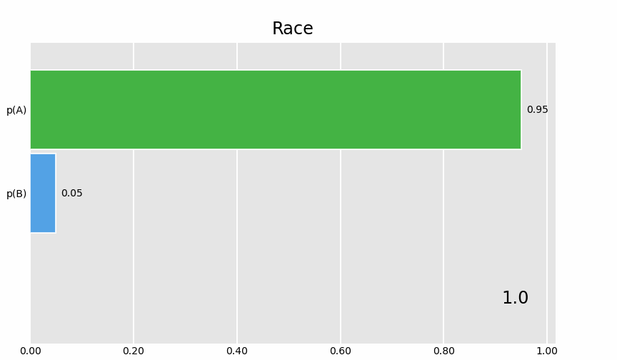

# Bar Chart Race

Create an animated GIF of two bar charts racing, whether it makes sense or not.
The main point was to make sure that this library was working.

## Setup

  1. Create and activate a virtual environment (called `bcr` here) as you like:

         python -m venv ~/.virtualenvs/bcr       # you can use another name
         source ~/.virtualenvs/bcr/bin/activate  # here we call it bcr

     I prefer good ol' `venv` but you can use `conda` or `forge`, etc.

  2. Clone the repo if you haven't yet, then enter the `bar_chart_race` folder:

         git clone https://github.com/icedwater/so_random
         cd bar_chart_race

  3. Install the github version of `bar_chart_race` as in _requirements.txt_:

         pip install -r requirements.txt

  4. Run the script:

         python test.py

  5. You should see warnings (until I fix them) but _race.gif_ appears. If the
     code runs fine, the output GIF will match the committed version, so there
     should be no difference in `git diff`:

         git diff

## The GIF in question

